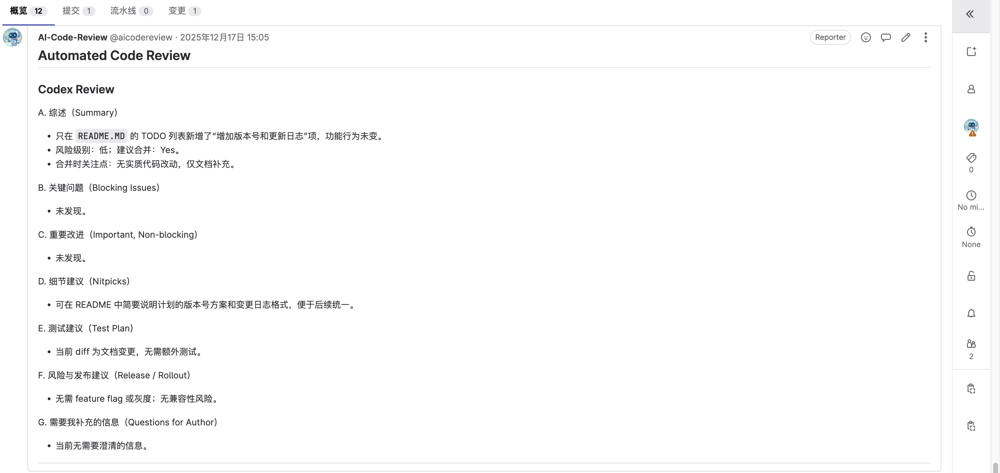

# GitLab 自动代码审查工具

CLI 工具，用于获取当前 GitLab 用户作为 Reviewer 的打开 Merge Request，下载 diff 并通过本地agent 进行审查, 最后把审查意见发送到gitlab。

## 使用
- 复制 `.env.example` 为 `.env` 并填写 GitLab 访问令牌与 Host。
- 创建并激活虚拟环境，安装依赖：`pip install -r requirements.txt`。

```bash
usage: main.py [-h] [--project-id PROJECT_ID] [--mr-iid MR_IID] [--gitlab-url GITLAB_URL] [--gitlab-token GITLAB_TOKEN]
               [--log-dir LOG_DIR] [--daemon] [--interval INTERVAL] [--codex] [--gemini] [--claude] [--cursor]

Auto Code Review for GitLab using multiple AI Agents

options:
  -h, --help            show this help message and exit
  --project-id PROJECT_ID
                        GitLab Project ID (Optional)
  --mr-iid MR_IID       Merge Request IID (Optional. Requires --project-id)
  --gitlab-url GITLAB_URL
                        GitLab URL
  --gitlab-token GITLAB_TOKEN
                        GitLab Private Token
  --log-dir LOG_DIR     Directory to save review logs
  --daemon              Run in daemon mode (continuously)
  --interval INTERVAL   Check interval in seconds for daemon mode (default: 600)
  --codex               Use Codex
  --gemini              Use Gemini
  --claude              Use Claude
  --cursor              Use Cursor Agent
```

## 注意事项
目前仅在codex上测试成功，gemini测试失败，claude和cursor没有能力测试

通过编辑agents.json，可以增加或删除agents


## 最佳实践
- 在gitlab上创建一个账号，专门用于AI代码审核。创建这个账号的Token填入.env中。
想让AI审核时，就把这个账号加到仓库中，给一个Reporter角色，然后创建merge request, 将审核人设置为这个账号

- 程序通过`--daemon --interval 10`在后台持续运行，定时拉取merge request, 并将审核意见发送到gitlab

- 可以通过修改src/prompt.md来调整提示词

## 截图


## 其它
本项目的代码由Gemini生成

